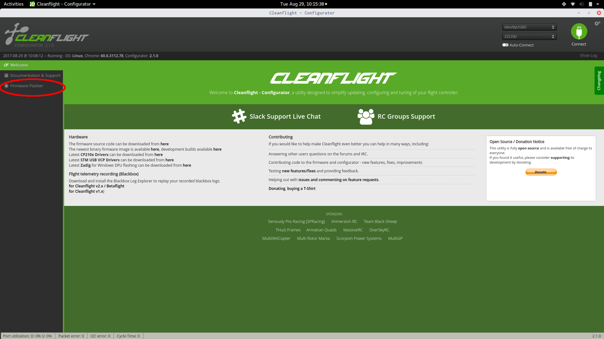

# Install Guide for Cleanflight and Control via MSP

## Compiling Firmware

Download [firmware](https://github.com/cleanflight/cleanflight) and compile with

`make TARGET=NAZE OPTIONS=USE_MSP_UART`

There is also a version located [cleanflight_2.1.0_NAZE.hex](here). 

## Flashing Fimware

1. Open the [cleanflight configurator](https://chrome.google.com/webstore/detail/cleanflight-configurator/enacoimjcgeinfnnnpajinjgmkahmfgb)
and go to the "Firmware Flasher" tab.  This tab is before you connect to the base station. 

2. Click "Load Firmware \[local\]" and load your custom firmware file from 
`cleanflight/obj/cleanflight_x.y.z_NAZE.hex`

3. Click the "Flash Firmware" button to flash the flight controller.

4. If this is a success, the bar at the bottom will say "Programming: 
SUCCESSFUL" and you are ready to move to the next step.

## Configuration Options

1. Plug in Skyline and click "Connect"

2. Go to "Ports" tab and make sure SerialRX for UART2 is disabled and click "Save and Reboot"

3. Go to "Configuration" tab 

    a. Flip the yaw by 180 degrees and click "Save and Reboot"

    

    b. Also change the receiver to "MSP_RX" and click "Save and Reboot"

    

4. Go to the "Receiver" tab and change the input map to "AERT1234" and click "Save"

5. Go to the "Modes" tab

    a. Under "Angle", click "Add Range"

    

    b. Drag the sliders so that the range spans from 900 to 2100

    

    

    c. Click "Save"

6. Go to the "PID Tuning" tab

    a. Change the "ROLL" and "PITCH" PID terms to match the image

    

    b. Change the "Angle Limit" to 50

    

    c. Click "Save"

7. Plug the skyline back into the Pi and you should be set to fly!

## Other Options

### Throttle Angle Compensation

Go to "CLI" tab and type

`set thr_corr_value = XX` and `set thr_corr_angle = YY`

This will set it (linearly?) so that it adds `XX` to the throttle when at angle `YY`
