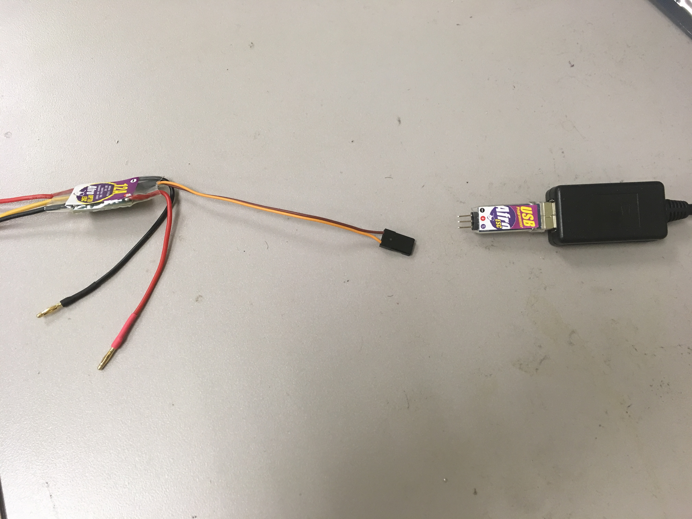
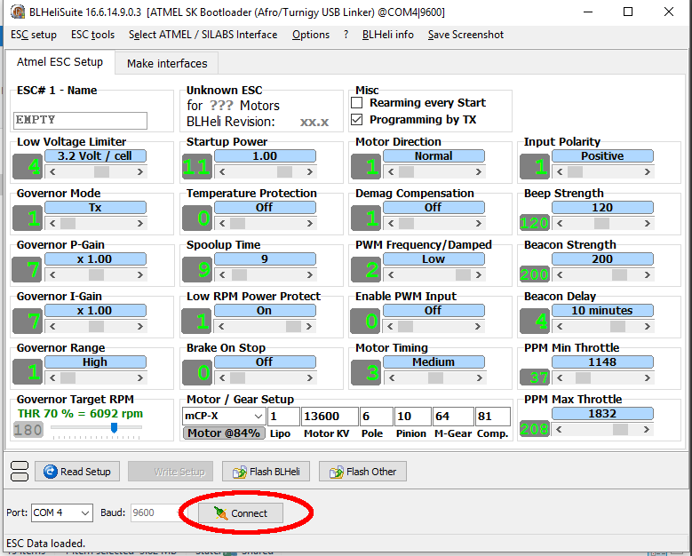
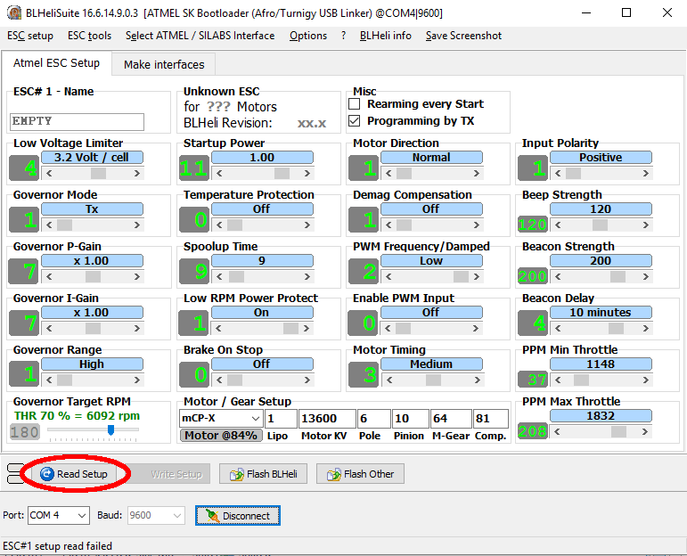
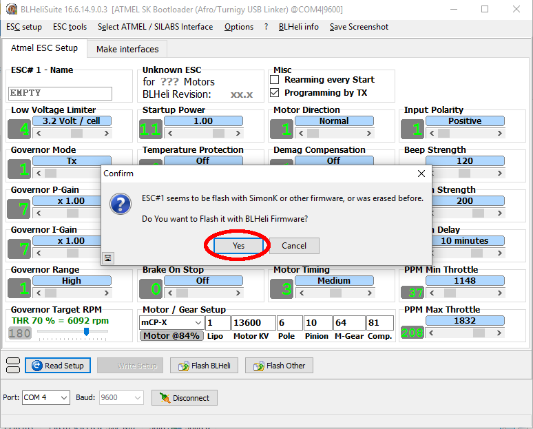
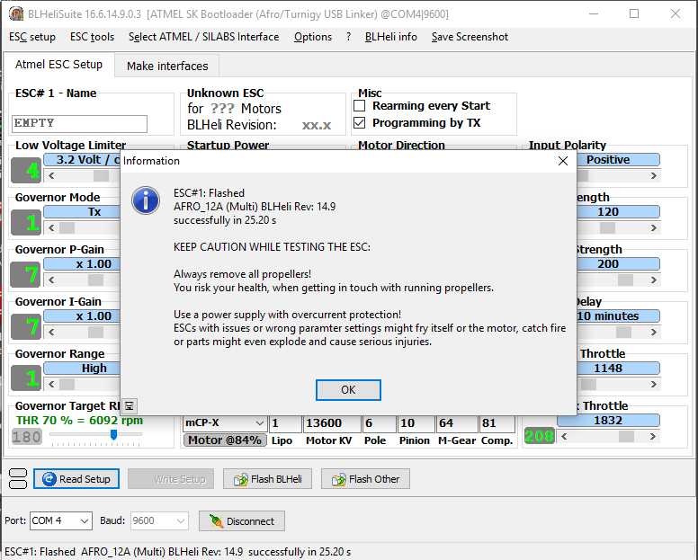
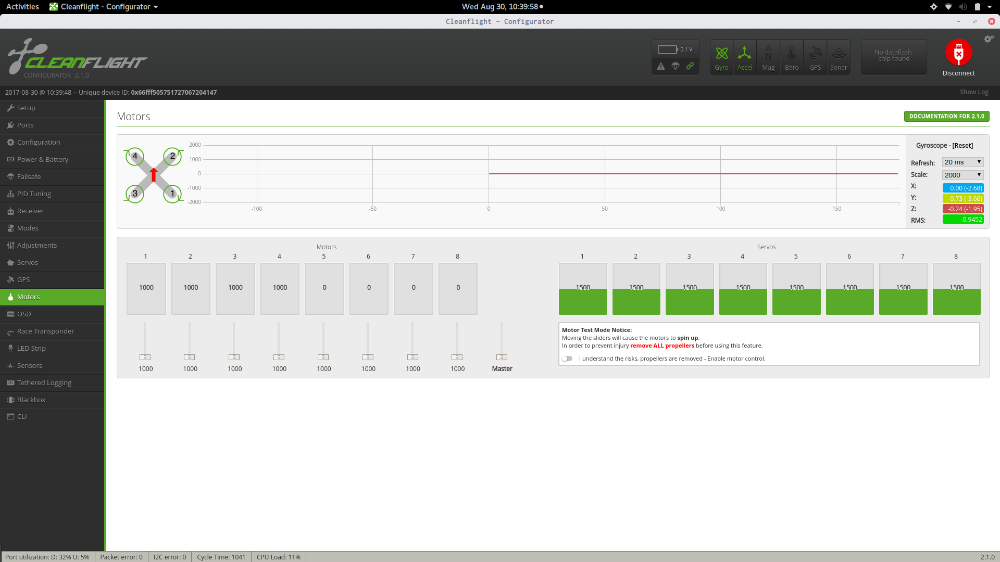
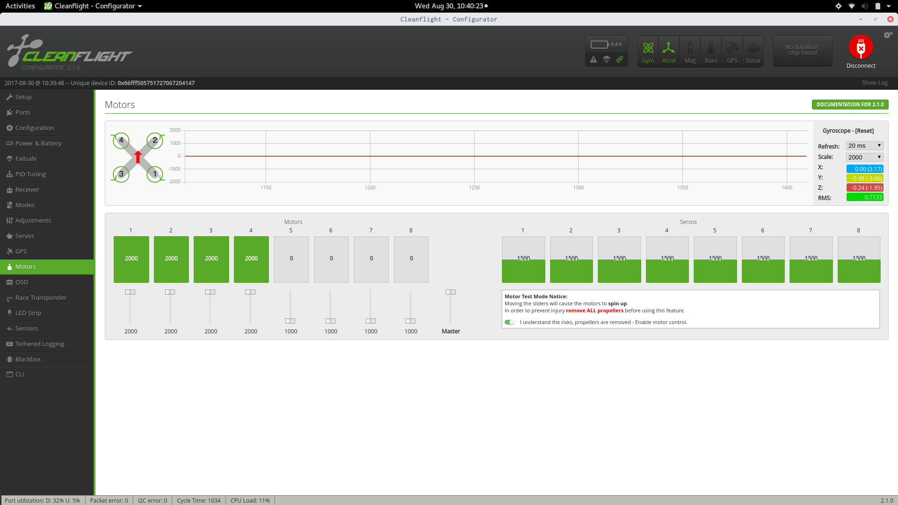
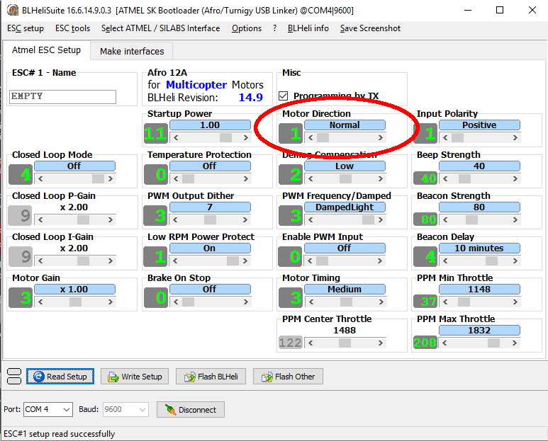
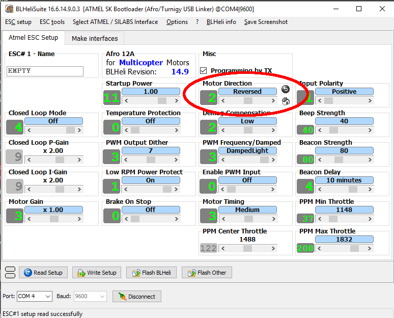

# Flight Controller and ESC Setup and Calibration

Your flight controller should be flashed and configured correctly at this time.
If not, refer to the previous instructions.

## Flashing ESCs

Repeat this procedure four times, one for each ESC.

1. Plug in the battery to your drone

2. Plug the ESC into the flashing tool

3. Click the "Connect" button in BLHeliSuite

4. Click the "Read Setup" button

5. When prompted to flash your ESC, click "Yes"

6. A window will appear, notifying you that you are flashing the ESC

7. When finished, a window will appear, notifying you that the ESC has properly
been flashed. If there are any errors, call over a TA. Click "OK" to dismiss 
the window.

8. A window will appear notifying you that the ESC setup has been read 
successfully. Click "OK".

9. Change the "PPM Min Throttle" 1100 and the "PPM Max Throttle" to 1900

## Checking ESC Direction

With all ESCS plugged correctly into the Skyline, battery plugged in, and 
propellers not attached:

1. Connect to the Skyline as you did earlier

2. Go to the "Motors" tab

3. Enable the motor control

4. Bring the "Master" slider slowly from 1000 to 2000.

5. The motors should be spinning. Check that they are all spinning in the 
correct directions.

6. Bring the "Master" slider slowly from 1000 to 2000.

7. For each motor

    a. Raise the slider slowly from 1000 to 2000 and check that the number of 
    the slider corresponds to the motor that spins, according to the diagram 
    above.

    b. Bring the slider slowly down from 2000 to 1000

8. Disable motor control

## Flipping ESC Direction

With the battery plugged in, follow the instructions below for each motor that
is spinning the wrong way:

1. Plug the ESC into the flashing tool as you did before

2. Click the "Connect" button

3. Click the "Read Setup" button

4. Move the slider underneath the "Motor Direction" so that the 
"Motor Direction" is "Reversed"

5. Click "Disconnect"

Plug all ESCS back into your Skyline

