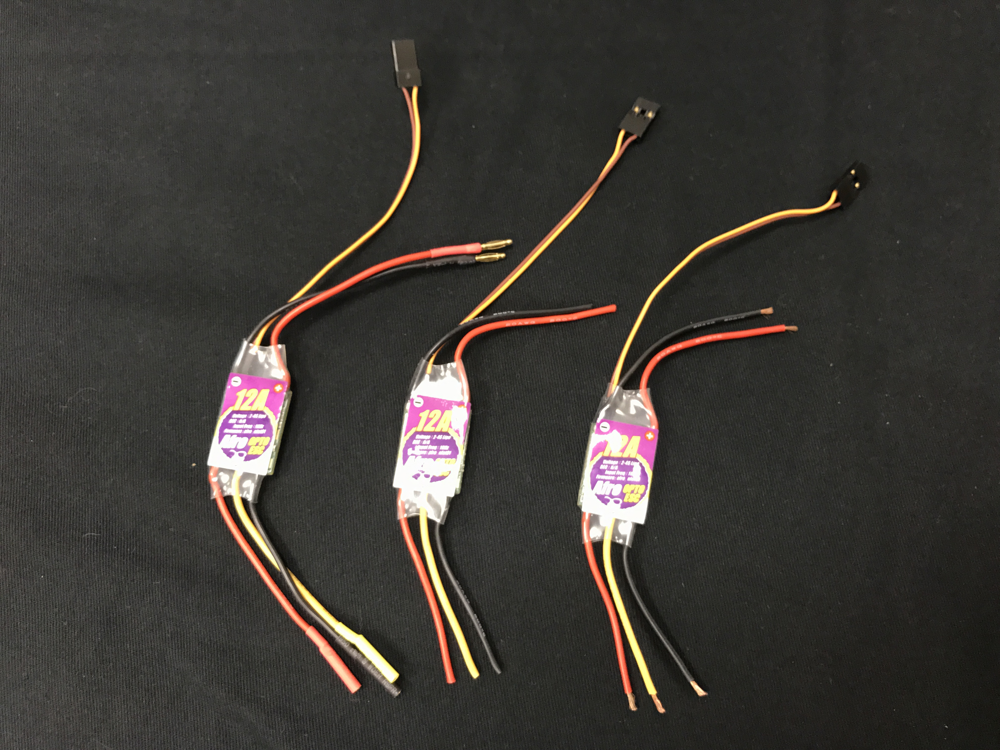
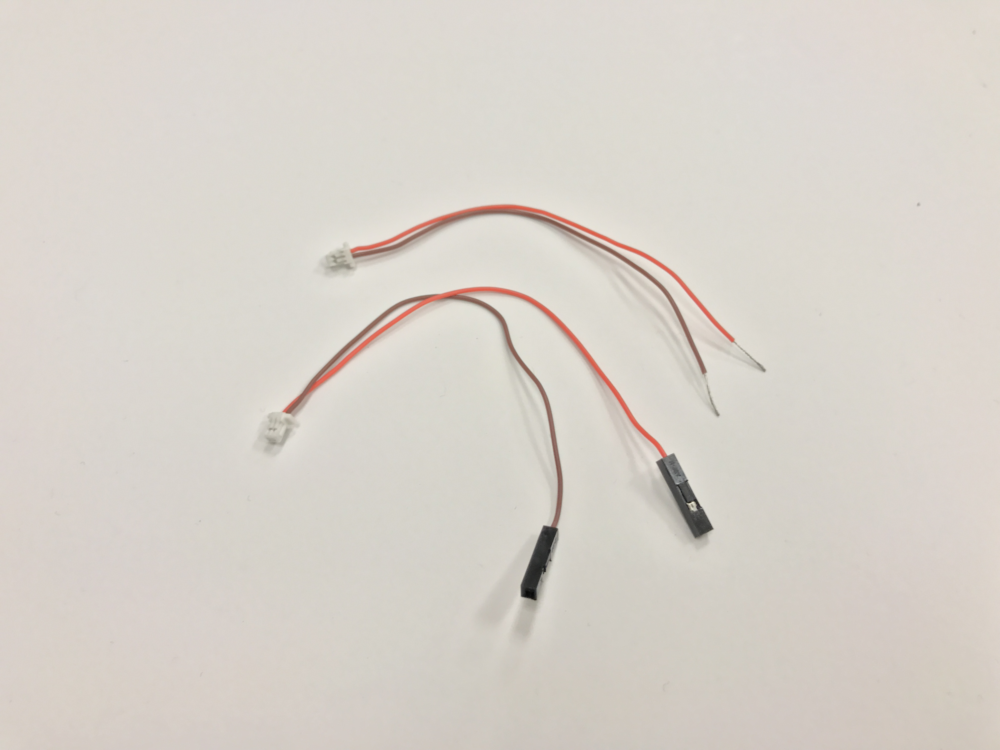
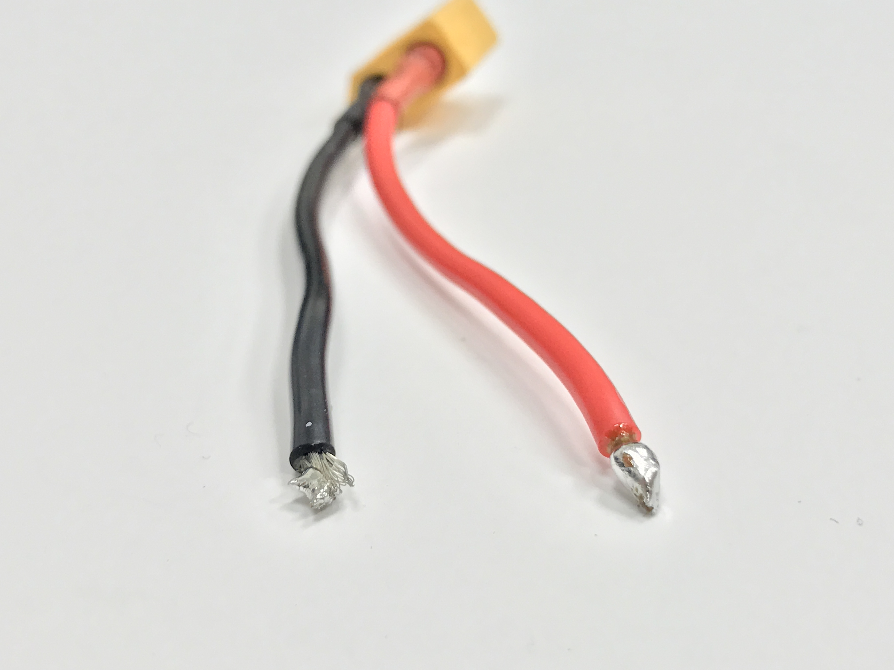

# Power Distribution

Just like the human body has a circulatory system to carry oxygen-rich blood to wherever it is needed, the drone has a power distribution board to take the all-important battery power and send it to every component. In this step, you will mount 4 ESCs (electronic speed controllers), a BEC (battery eliminator circuit), a battery lead with XT60 connector, and a battery monitor lead to your PDB (power distribution board). 

## Strip Wires

Cut off all the connectors on the thick wires of the ESC as close to the connector as possible. Leave the PWM signal connector alone.
Strip 0.5 cm from each of the wires you just cut. 

Strip 0.5cm off your battery lead with XT60 connector.

Inside the plastic box labeled, SKYLINE 32, find the battery monitor lead, cut off the two larger connectors, and strip 1cm.

## Tin PDB and Stripped wires.

Tin all 20 ESC leads.
Twist the battery monitor leads around the BEC leads and tin.

Thoroughly tin the battery lead with XT60 connector. It is important that solder flows all the way through the exposed wire. 

